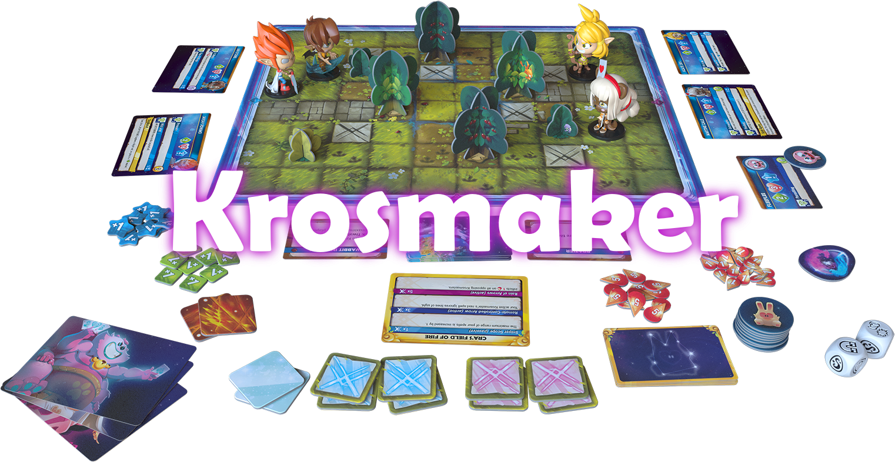
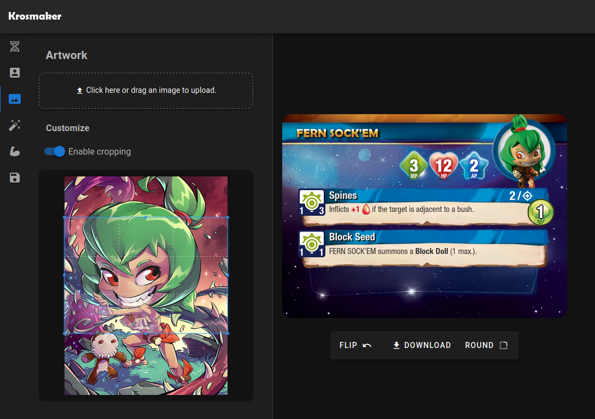

# Krosmaker

[**Krosmaker**](https://krosmaker.github.io) is an online card creator
tool for the **Krosmaster: Blast** board game. Create custom cards for
your Krosmasters!



You can find some of the cards created with **Krosmaker** on
[Twitter](https://twitter.com/krosmaker).

Need help? [See the wiki!](https://github.com/krosmaker/krosmaker/wiki)

### Features

**Krosmaker** lets you create custom cards that closely resemble
the original **Krosmaster: Blast** aesthetic.

Main features include:

- Fighter cards editor:
  - Complete support for Krosmaster and Minion cards.
  - Figurine and artwork image editors with customizable cropping.
  - Spells and powers editors.
  - Ability editors supporting all symbols and markers.
  - Support for two-sided cards with a second profile variant
    instead of an artwork at the other side of the card.
- Krosmic Favor cards editor:
  - Complete support for Krosmic Favor cards.
  - Customizable title and card type.
  - Effect editor supporting all symbols and markers.
- Divine Challenge cards editor:
  - Complete support for Divine Challange cards.
  - Power editor supporting all symbols and markers.
  - Artwork image editor with customizable cropping.
- Saving and loading cards using a local browser database.
- JSON export allowing to save and load card configurations.
- Card image export _(on Firefox and Chrome)._
  - 300 DPI support.
  - Size adjustment with customizable bleed area for printing.
- Translations:
  - English.
  - French.
  - Spanish.
  - Brazilian Portuguese.
  - Polish.

The card graphics were extracted from the official PDFs and
published with **Ankama**'s permission.

## Running from sources


### Docker

The default [`Dockerfile`](Dockerfile) builds the application and serves
the generated static resources with _NGINX._ It is recommended to run
the application via _Docker Compose_:

```bash
$ docker-compose build
$ docker-compose up
# The application should be available at localhost.
```

### Node.js

The supported _Node.js_ version is stored in [`.nvmrc`](.nvmrc).
You can run the following commands after cloning the repository:

```bash
# Install dependencies:
$ npm install

# Serve the application at localhost:3000 with hot reload:
$ npm run dev

# Build for deployment and launch a local server:
$ npm run build
$ npm run start

# Generate a static project:
$ npm run generate

# Run the formatter on the entire project:
$ npm run format
```

Note that the project might use several outdated library versions.
Before attempting to upgrade the dependencies, make sure that the
newer versions do not break the UI or cause any compilation issues.

For a detailed explanation of the project setup, check out
[the Nuxt.js documentation](https://nuxtjs.org).

## Contributors

- [**@czyzby**](https://github.com/czyzby/): app development, Polish translation.
- [**Marsza**](https://github.com/marszaa/): recreation of the Krosmaster dice icons.
- [**Jesús Martínez**](https://krosarchive.es/): Spanish translation.
- [**@SGe-GH**](https://github.com/SGe-GH): French translation, testing.
- **Wallace Nogueira "Luvenus"**: Brazilian Portuguese translation.

> The graphics and other assets from the **Krosmaster: Blast**
> are copyrighted by **Ankama** and published with their permission.
> This project is not produced by or affiliated with **Ankama**.
